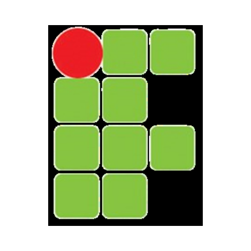

# Projeto secitec

> Status : Finished project ✅ / Open PR

##  IFPB-CR Project 

*Technologies*

+ PHP 
+ HTML 
+ CSS 
+ SCSS 
+ JavaScript 
+ PHPMailer 

### How to use
    
- git clone https://github.com/12Gustavo21/projeto-secitec.git
- code .
- start a localhost server 

## 💻 Online Page: None yet

## 🌐 Contact me:
 

##  Contact the IFPB-CR:
   
